# 🔐 PetCare Security Architecture Diagrams

**Proje:** PetCare Management System - Security Architecture  
**Tarih:** 2025-12-25  
**Versiyon:** 1.0

---

## 📋 İçindekiler

1. [Genel Sistem Mimarisi](#1-genel-sistem-mimarisi)
2. [Güvenlik Katmanları](#2-güvenlik-katmanları)
3. [Kimlik Doğrulama Akışı](#3-kimlik-doğrulama-akışı)
4. [Whitebox Kriptografi Akışı](#4-whitebox-kriptografi-akışı)
5. [RASP Güvenlik Mekanizmaları](#5-rasp-güvenlik-mekanizmaları)
6. [Bellek Güvenliği Akışı](#6-bellek-güvenliği-akışı)
7. [Veritabanı Şifreleme Mimarisi](#7-veritabanı-şifreleme-mimarisi)
8. [Session Yönetimi](#8-session-yönetimi)
9. [Kod Sertleştirme (Obfuscation)](#9-kod-sertleştirme-obfuscation)
10. [Tehdit Modeli](#10-tehdit-modeli)
11. [Veri Akış Diyagramları](#11-veri-akış-diyagramları)
12. [Saldırı Yüzeyi Analizi](#12-saldırı-yüzeyi-analizi)

---

## 1. Genel Sistem Mimarisi

### 1.1 Yüksek Seviye Sistem Mimarisi

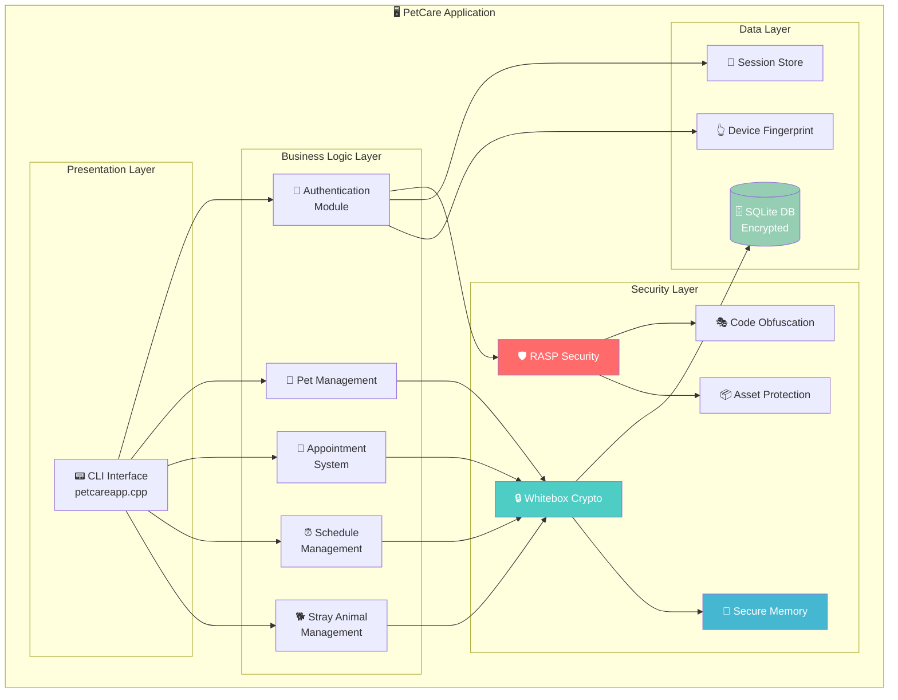

### 1.2 Modül Bağımlılık Diyagramı

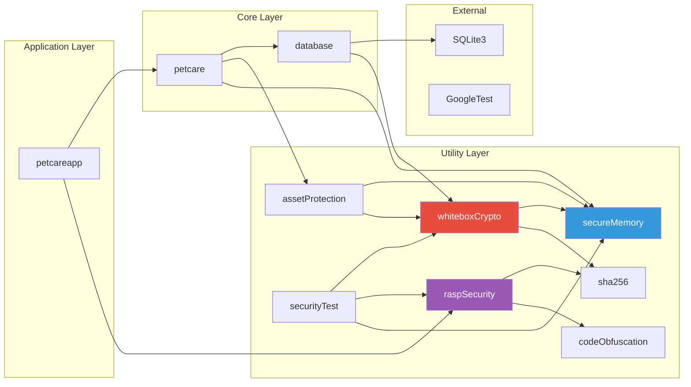

---

## 2. Güvenlik Katmanları

### 2.1 Defense in Depth (Derinlemesine Savunma)

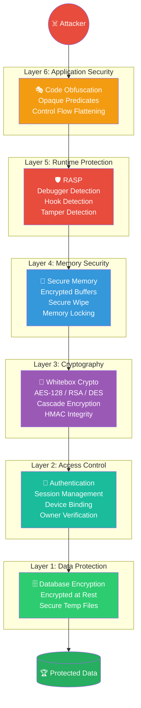

### 2.2 Güvenlik Bileşenleri İlişki Diyagramı

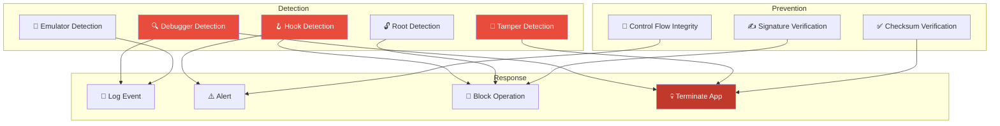

---

## 3. Kimlik Doğrulama Akışı

### 3.1 Login Flow (Oturum Açma Akışı)

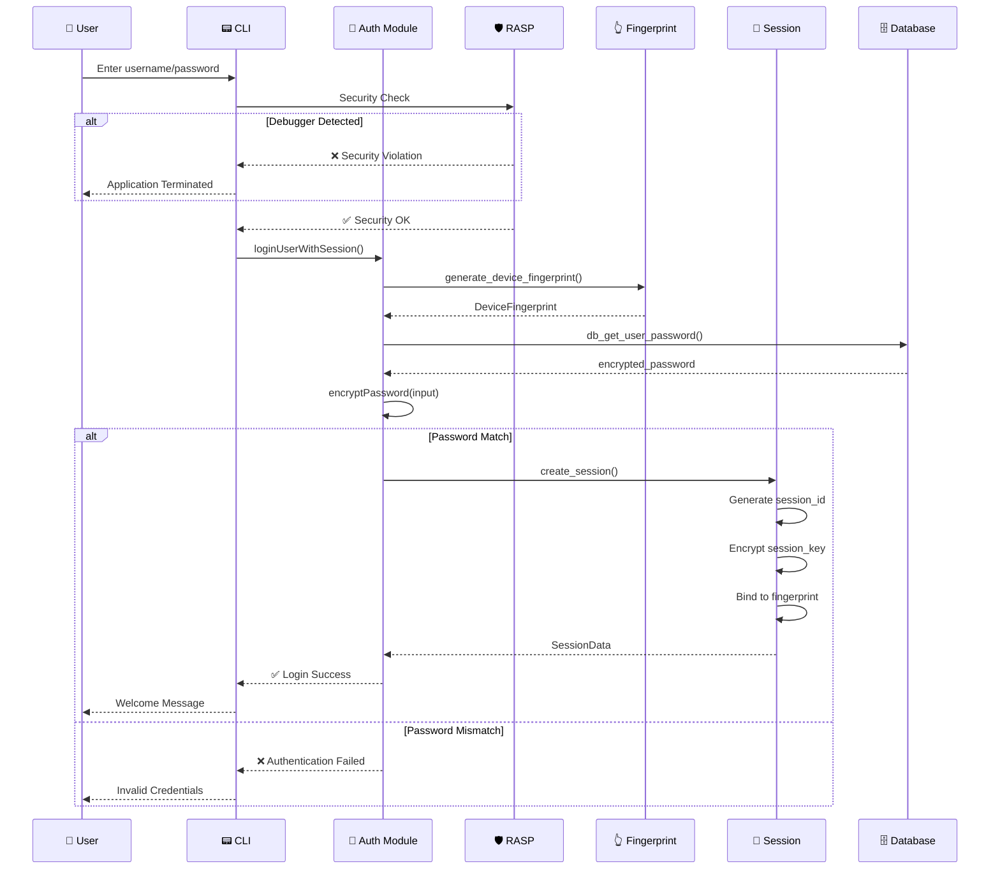

### 3.2 Session Doğrulama Akışı

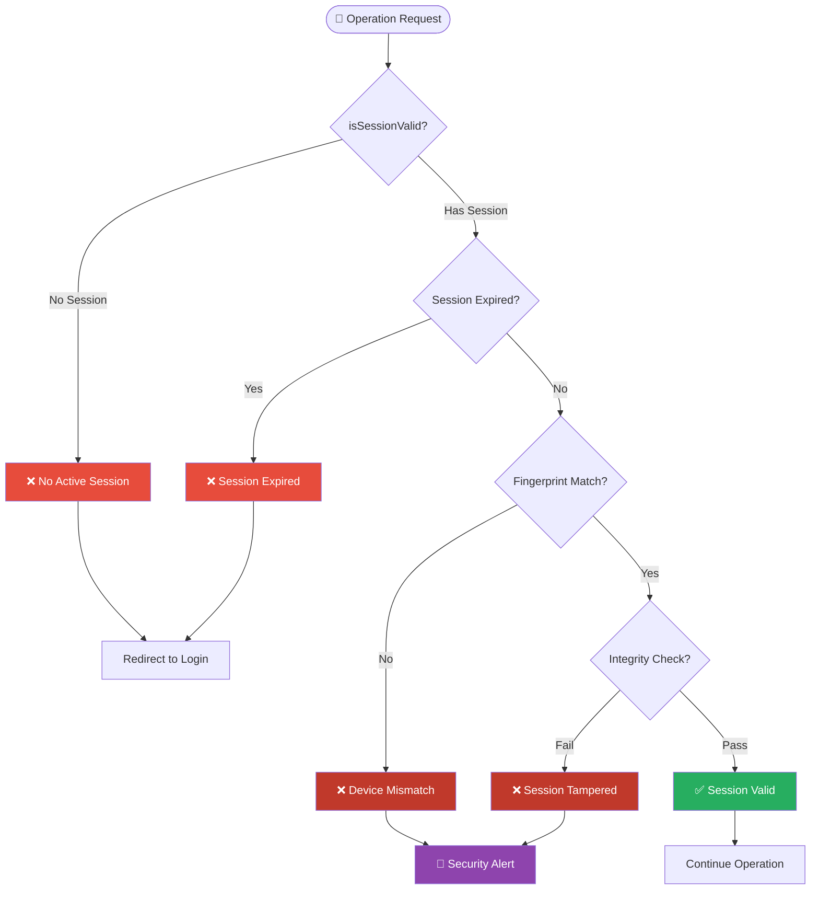

---

## 4. Whitebox Kriptografi Akışı

### 4.1 Cascade Encryption (AES → DES → AES)

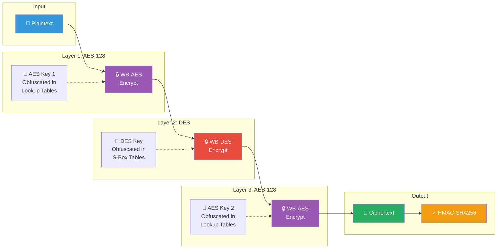

### 4.2 Dosya Şifreleme Yapısı

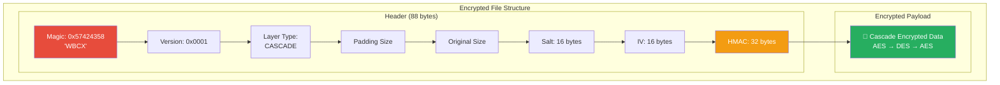

### 4.3 Anahtar Türetme (Key Derivation)

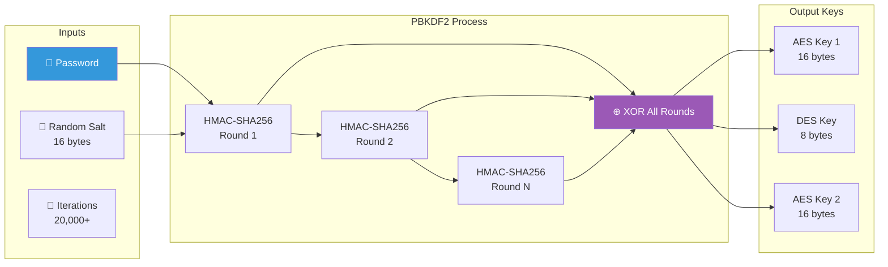

---

## 5. RASP Güvenlik Mekanizmaları

### 5.1 RASP Genel Akışı

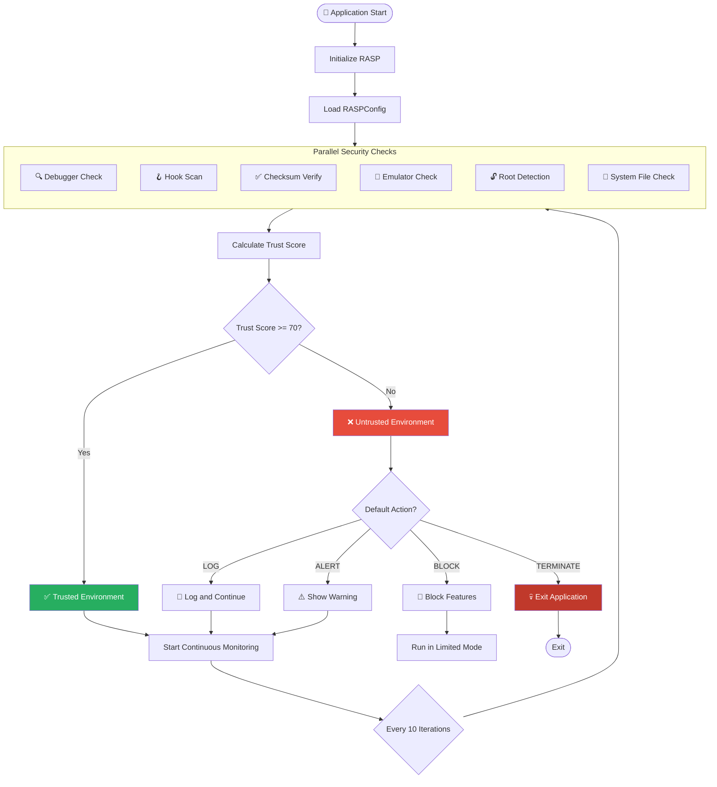

### 5.2 Debugger Detection Mekanizmaları

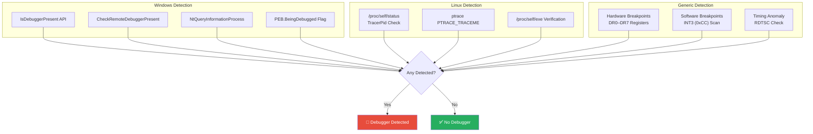

### 5.3 Hook Detection Akışı

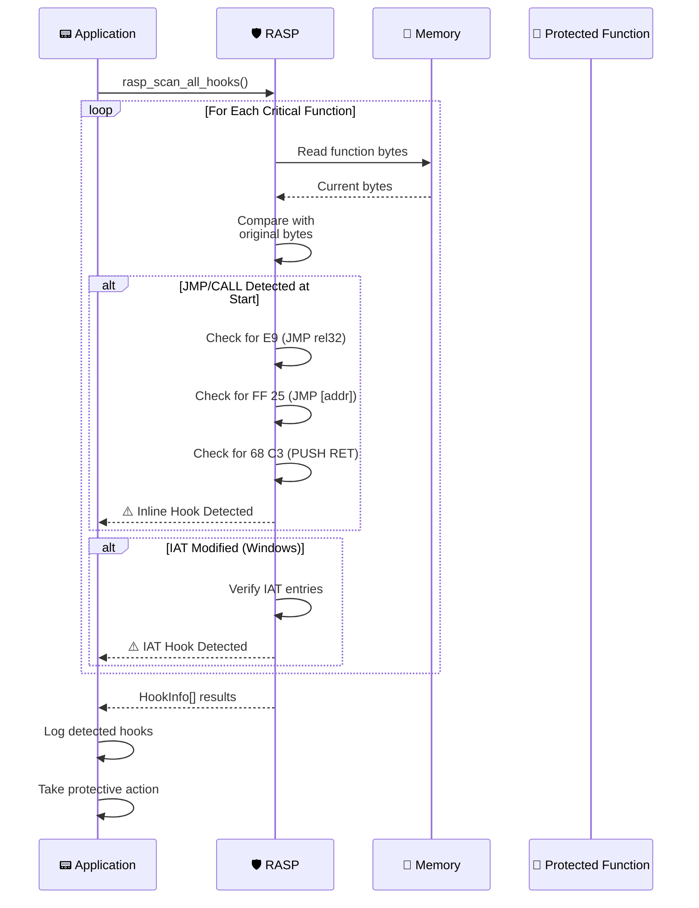

### 5.4 Control Flow Integrity (CFI)

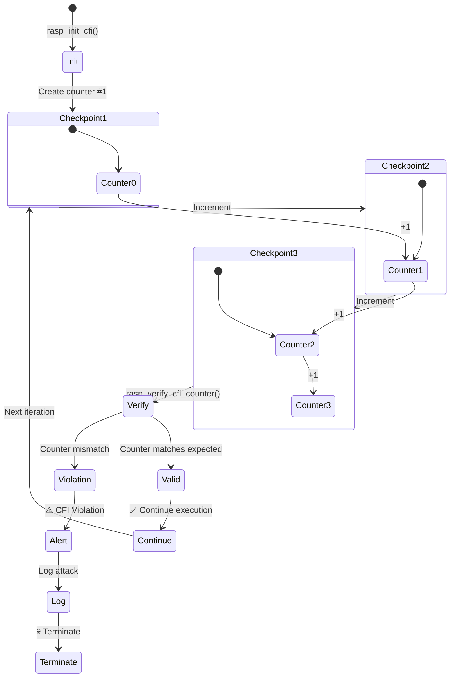

---

## 6. Bellek Güvenliği Akışı

### 6.1 Secure Memory Lifecycle

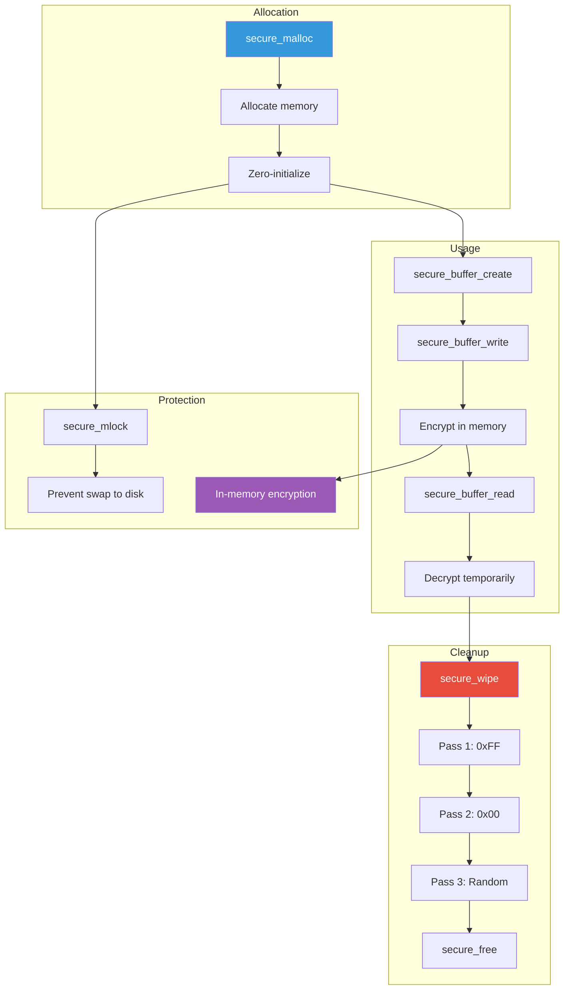

### 6.2 SecureBuffer Yapısı

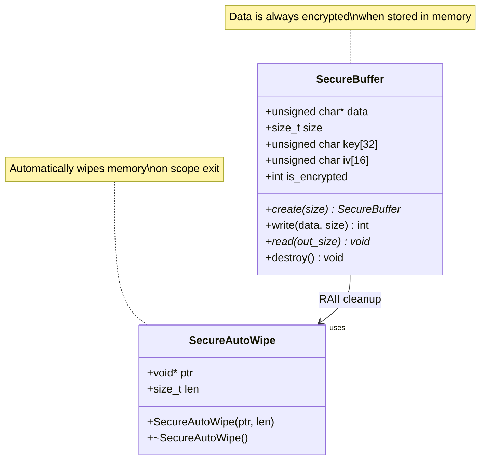

### 6.3 Memory Wipe Process

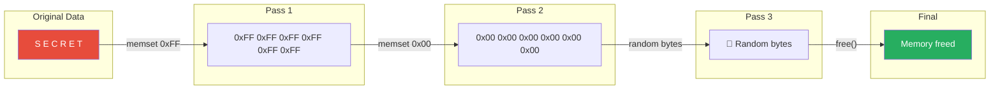

---

## 7. Veritabanı Şifreleme Mimarisi

### 7.1 Database Encryption Flow

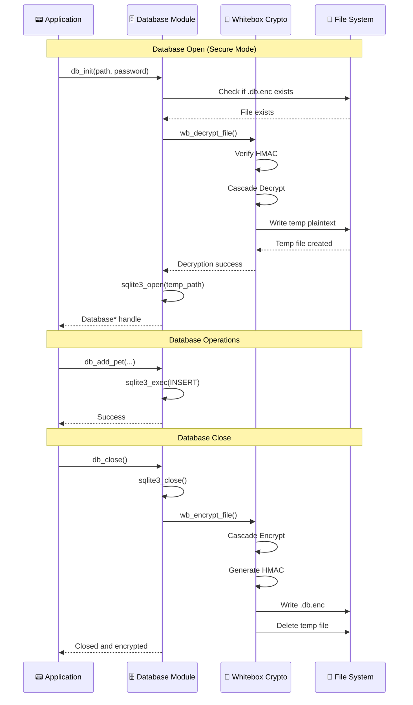

### 7.2 Veritabanı Şema Güvenliği

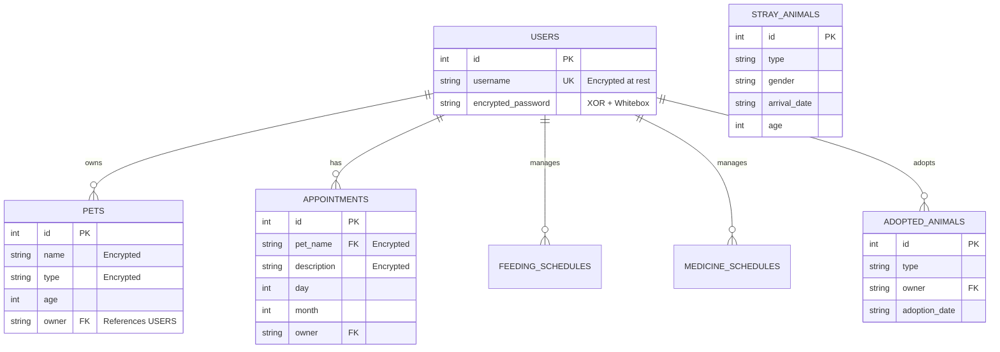

---

## 8. Session Yönetimi

### 8.1 Session Lifecycle

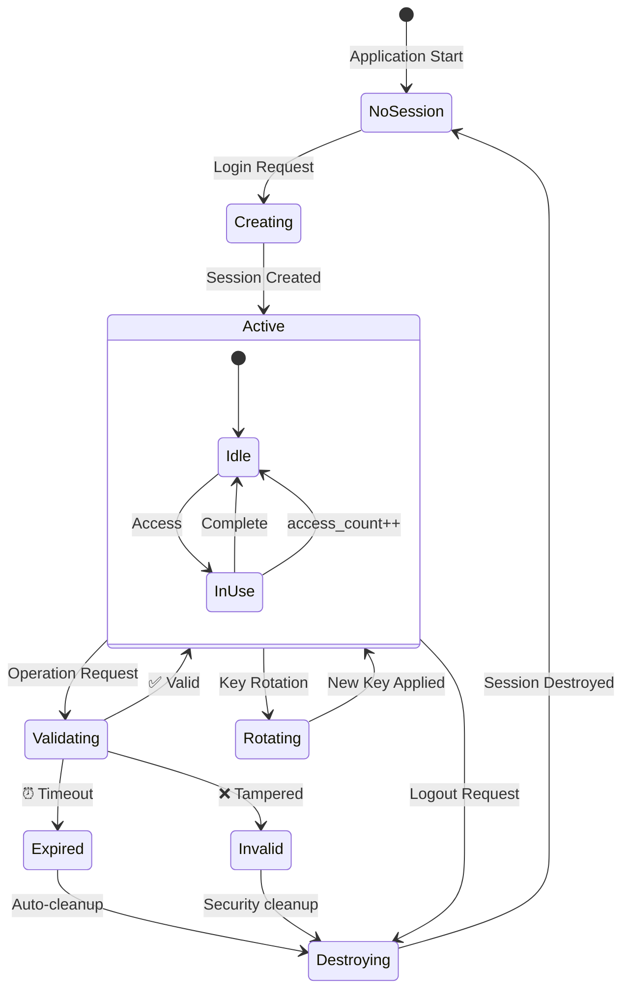

### 8.2 Session Data Structure

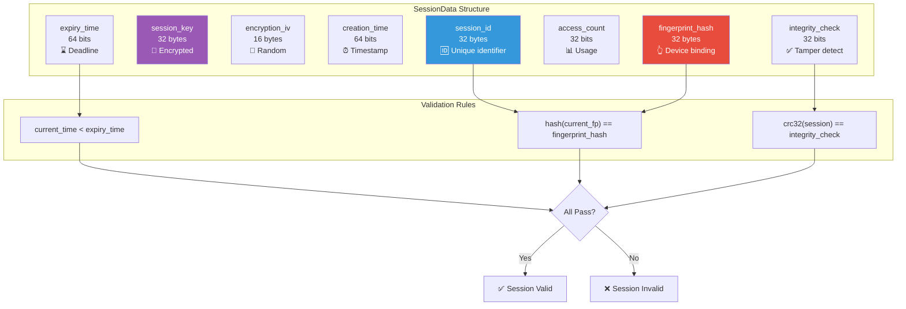

---

## 9. Kod Sertleştirme (Obfuscation)

### 9.1 Obfuscation Teknikleri

```mermaid
mindmap
  root(("Code Obfuscation"))
    Opaque Predicates
      opaque_true
        always_even_property
      opaque_false
        impossible_condition
      opaque_complex
        algebraic_identity
    MBA Operations
      obf_add
        bitwise_equivalent
      obf_sub
        complement_and_add
      obf_mul_const
        shift_add_method
    Control Flow
      CFDispatcher
      cf_transition
      random_exit_points
    String Obfuscation
      xor_encoding
      evolving_key
      runtime_decode
    Dead Code
      inject_dead_code
      fake_operation
      never_executes
    Stdlib Wrappers
      obf_strcpy
      obf_memcpy
      obf_strlen
      obf_strcmp
```

### 9.2 Opaque Predicate Akışı

```mermaid
graph TD
    subgraph "opaque_true(x)"
        IN1["Input: x"]
        CALC1["a = x^2 + x"]
        MOD1["result = a mod 2"]
        CHECK1{"result == 0?"}
        OUT1_T["Return TRUE"]
        OUT1_F["Never reached"]
    end
    
    subgraph "Mathematical Proof"
        PROOF["x^2 + x = x(x + 1)<br/>Product of consecutive integers<br/>Always even"]
    end
    
    IN1 --> CALC1 --> MOD1 --> CHECK1
    CHECK1 -->|Always| OUT1_T
    CHECK1 -.->|Never| OUT1_F
    
    PROOF -.-> CHECK1
    
    style OUT1_T fill:#27ae60,color:#fff
    style OUT1_F fill:#7f8c8d,color:#fff
    style PROOF fill:#f39c12,color:#fff
```

### 9.3 Control Flow Flattening

```mermaid
graph TD
    subgraph "Original Code"
        O1[Statement 1]
        O2[Statement 2]
        O3{Condition}
        O4[Then branch]
        O5[Else branch]
        O6[Statement 3]
    end
    
    O1 --> O2 --> O3
    O3 -->|True| O4
    O3 -->|False| O5
    O4 --> O6
    O5 --> O6
    
    subgraph "Flattened Code"
        INIT[state = 0]
        SW{Switch state}
        S0[Case 0: Statement 1<br/>state = 1]
        S1[Case 1: Statement 2<br/>state = 2]
        S2[Case 2: Check condition<br/>state = 3 or 4]
        S3[Case 3: Then branch<br/>state = 5]
        S4[Case 4: Else branch<br/>state = 5]
        S5[Case 5: Statement 3<br/>state = -1]
        LOOP{state >= 0?}
    end
    
    INIT --> SW
    SW --> S0
    SW --> S1
    SW --> S2
    SW --> S3
    SW --> S4
    SW --> S5
    S0 --> LOOP
    S1 --> LOOP
    S2 --> LOOP
    S3 --> LOOP
    S4 --> LOOP
    S5 --> LOOP
    LOOP -->|Yes| SW
    
    style SW fill:#9b59b6,color:#fff
```

---

## 10. Tehdit Modeli

### 10.1 STRIDE Threat Model

```mermaid
graph TD
    subgraph "STRIDE Threats"
        S[🎭 Spoofing<br/>Identity falsification]
        T[🔧 Tampering<br/>Data modification]
        R[🚫 Repudiation<br/>Deny actions]
        I[📖 Info Disclosure<br/>Data leakage]
        D[💣 DoS<br/>Service disruption]
        E[👑 Elevation<br/>Privilege escalation]
    end
    
    subgraph "Mitigations"
        M_S[Session + Device Binding<br/>Password Hashing]
        M_T[HMAC Integrity<br/>Checksum Verification<br/>Tamper Detection]
        M_R[Audit Logging<br/>Digital Signatures]
        M_I[Encryption at Rest<br/>Secure Memory<br/>Memory Wipe]
        M_D[Rate Limiting<br/>Resource Management]
        M_E[Owner Verification<br/>Access Control<br/>CFI]
    end
    
    S --> M_S
    T --> M_T
    R --> M_R
    I --> M_I
    D --> M_D
    E --> M_E
    
    style S fill:#e74c3c,color:#fff
    style T fill:#e74c3c,color:#fff
    style R fill:#e74c3c,color:#fff
    style I fill:#e74c3c,color:#fff
    style D fill:#e74c3c,color:#fff
    style E fill:#e74c3c,color:#fff
    
    style M_S fill:#27ae60,color:#fff
    style M_T fill:#27ae60,color:#fff
    style M_R fill:#27ae60,color:#fff
    style M_I fill:#27ae60,color:#fff
    style M_D fill:#27ae60,color:#fff
    style M_E fill:#27ae60,color:#fff
```

### 10.2 Attack Tree

```mermaid
graph TD
    GOAL[🎯 Compromise PetCare App]
    
    GOAL --> A1[Extract Sensitive Data]
    GOAL --> A2[Bypass Authentication]
    GOAL --> A3[Inject Malicious Code]
    GOAL --> A4[Reverse Engineer App]
    
    A1 --> A1_1[Memory Dump]
    A1 --> A1_2[Database File Access]
    A1 --> A1_3[Debug & Inspect]
    
    A2 --> A2_1[Brute Force Password]
    A2 --> A2_2[Session Hijack]
    A2 --> A2_3[Spoof Device Fingerprint]
    
    A3 --> A3_1[DLL Injection]
    A3 --> A3_2[Hook Critical Functions]
    A3 --> A3_3[Modify Binary]
    
    A4 --> A4_1[Static Analysis]
    A4 --> A4_2[Dynamic Analysis]
    A4 --> A4_3[Extract Crypto Keys]
    
    subgraph "Defenses"
        D1[🛡️ Secure Memory Wipe]
        D2[🔐 Whitebox Encryption]
        D3[🔍 Debugger Detection]
        D4[⏱️ Rate Limiting]
        D5[👆 Device Binding]
        D6[🪝 Hook Detection]
        D7[✅ Checksum Verify]
        D8[🎭 Code Obfuscation]
    end
    
    A1_1 -.->|Blocked by| D1
    A1_2 -.->|Blocked by| D2
    A1_3 -.->|Blocked by| D3
    A2_1 -.->|Blocked by| D4
    A2_3 -.->|Blocked by| D5
    A3_2 -.->|Blocked by| D6
    A3_3 -.->|Blocked by| D7
    A4_1 -.->|Blocked by| D8
    
    style GOAL fill:#c0392b,color:#fff
    style A1 fill:#e74c3c,color:#fff
    style A2 fill:#e74c3c,color:#fff
    style A3 fill:#e74c3c,color:#fff
    style A4 fill:#e74c3c,color:#fff
```

---

## 11. Veri Akış Diyagramları

### 11.1 Pet Management Data Flow

```mermaid
flowchart LR
    subgraph "User Input"
        UI[👤 User]
    end
    
    subgraph "Application Layer"
        CLI[📟 CLI]
        VAL[✅ Validation]
        AUTH[🔐 Auth Check]
    end
    
    subgraph "Business Layer"
        PET_ADD[addPet()]
        PET_UPD[updatePet()]
        PET_DEL[deletePet()]
        OWNER_CHK[isPetOwnedByUser()]
    end
    
    subgraph "Security Layer"
        RASP[🛡️ RASP Check]
        ENC[🔐 Encrypt Data]
    end
    
    subgraph "Data Layer"
        DB[(🗄️ SQLite)]
    end
    
    UI -->|"Pet info"| CLI
    CLI --> VAL
    VAL -->|Valid| AUTH
    AUTH -->|Authenticated| RASP
    
    RASP -->|Secure| PET_ADD
    RASP -->|Secure| PET_UPD
    RASP -->|Secure| PET_DEL
    
    PET_UPD --> OWNER_CHK
    PET_DEL --> OWNER_CHK
    OWNER_CHK -->|Authorized| ENC
    PET_ADD --> ENC
    
    ENC -->|Encrypted| DB
    
    DB -->|Response| ENC
    ENC -->|Decrypted| CLI
    CLI -->|Display| UI
```

### 11.2 Appointment Scheduling Flow

```mermaid
sequenceDiagram
    participant U as 👤 User
    participant C as 📟 CLI
    participant A as 📅 Appointment
    participant V as ✅ Validator
    participant D as 🗄️ Database
    participant E as 🔐 Encryption
    
    U->>C: Create appointment
    C->>V: Validate date (1-30, 1-12)
    
    alt Invalid Date
        V-->>C: ❌ Invalid date
        C-->>U: Error message
    end
    
    V->>D: db_is_date_occupied()
    
    alt Date Occupied
        D-->>C: ❌ Date busy
        C-->>U: Choose another date
    end
    
    V->>A: isPetOwnedByUser()
    
    alt Not Owner
        A-->>C: ❌ Permission denied
        C-->>U: Cannot schedule others' pets
    end
    
    A->>E: Encrypt description
    E->>D: db_add_appointment()
    D-->>A: ✅ Success
    A-->>C: Appointment created
    C-->>U: Confirmation
```

---

## 12. Saldırı Yüzeyi Analizi

### 12.1 Attack Surface Components

```mermaid
pie title Attack Surface Distribution
    "User Input (CLI)" : 25
    "File I/O (Database)" : 20
    "Memory (Sensitive Data)" : 20
    "Binary (Code)" : 15
    "Runtime (Process)" : 10
    "Configuration" : 10
```

### 12.2 Security Controls Matrix

```mermaid
graph TB
    subgraph "Assets"
        AS1[User Credentials]
        AS2[Pet Data]
        AS3[Session Keys]
        AS4[Encryption Keys]
        AS5[Application Binary]
    end
    
    subgraph "Threats"
        TH1[Credential Theft]
        TH2[Data Breach]
        TH3[Session Hijacking]
        TH4[Key Extraction]
        TH5[Code Tampering]
    end
    
    subgraph "Controls"
        C1[Password Hashing<br/>XOR Encryption]
        C2[Whitebox Crypto<br/>HMAC Integrity]
        C3[Device Binding<br/>Expiry Check]
        C4[Whitebox Tables<br/>Obfuscation]
        C5[Checksum Verify<br/>Anti-Debug]
    end
    
    AS1 --> TH1 --> C1
    AS2 --> TH2 --> C2
    AS3 --> TH3 --> C3
    AS4 --> TH4 --> C4
    AS5 --> TH5 --> C5
    
    style AS1 fill:#3498db,color:#fff
    style AS2 fill:#3498db,color:#fff
    style AS3 fill:#3498db,color:#fff
    style AS4 fill:#3498db,color:#fff
    style AS5 fill:#3498db,color:#fff
    
    style TH1 fill:#e74c3c,color:#fff
    style TH2 fill:#e74c3c,color:#fff
    style TH3 fill:#e74c3c,color:#fff
    style TH4 fill:#e74c3c,color:#fff
    style TH5 fill:#e74c3c,color:#fff
    
    style C1 fill:#27ae60,color:#fff
    style C2 fill:#27ae60,color:#fff
    style C3 fill:#27ae60,color:#fff
    style C4 fill:#27ae60,color:#fff
    style C5 fill:#27ae60,color:#fff
```

### 12.3 Compliance Mapping

```mermaid
graph LR
    subgraph "OWASP ASVS"
        V1[V1: Architecture]
        V2[V2: Authentication]
        V3[V3: Session]
        V4[V4: Access Control]
        V6[V6: Cryptography]
        V7[V7: Error Handling]
        V8[V8: Data Protection]
        V9[V9: Communication]
    end
    
    subgraph "Implementation"
        I1[Modular Design]
        I2[Password Hash + Session]
        I3[SessionData + DeviceBinding]
        I4[isPetOwnedByUser]
        I6[Whitebox AES/DES]
        I7[RASP Logging]
        I8[Secure Memory]
        I9[Local Only]
    end
    
    V1 --> I1
    V2 --> I2
    V3 --> I3
    V4 --> I4
    V6 --> I6
    V7 --> I7
    V8 --> I8
    V9 --> I9
    
    style V1 fill:#9b59b6,color:#fff
    style V2 fill:#9b59b6,color:#fff
    style V3 fill:#9b59b6,color:#fff
    style V4 fill:#9b59b6,color:#fff
    style V6 fill:#9b59b6,color:#fff
    style V7 fill:#9b59b6,color:#fff
    style V8 fill:#9b59b6,color:#fff
    style V9 fill:#9b59b6,color:#fff
```
